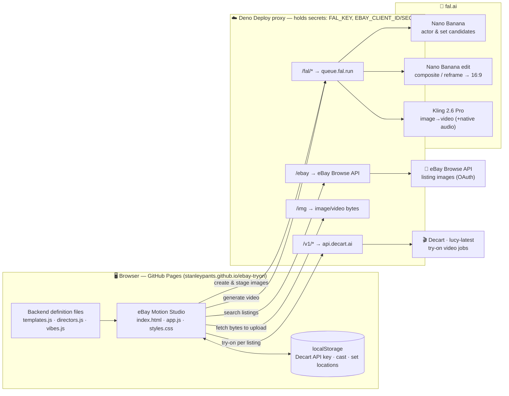
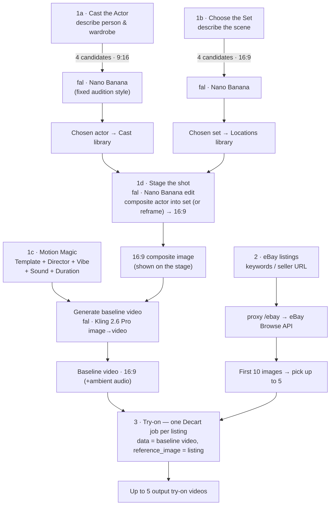
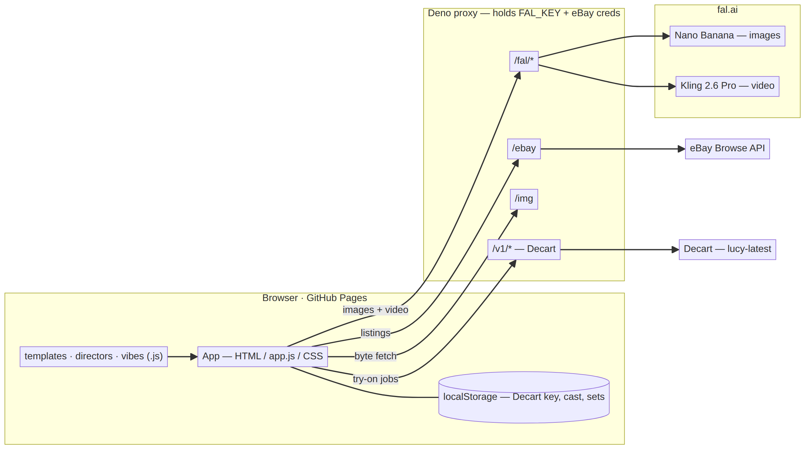
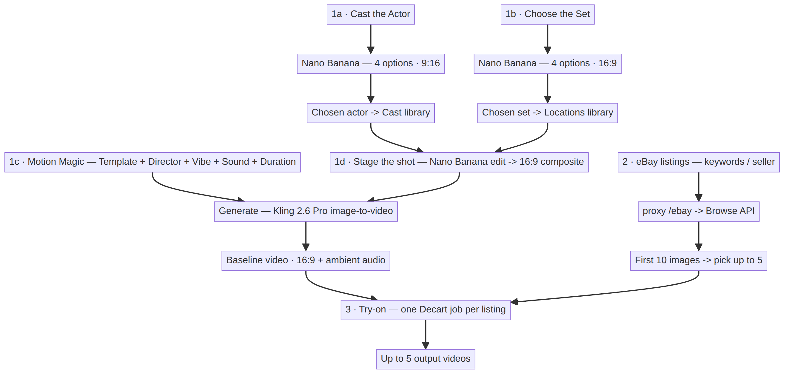

# eBay Motion Studio — Architecture

A static browser app (GitHub Pages) that talks to three external services **only through a thin
Deno Deploy proxy**, which holds every secret and adds the CORS headers the browser can't get directly.

## System / components



- **Browser** — vanilla HTML/CSS/JS, no build step. The Decart key and the user's saved **cast** /
  **set locations** live only in `localStorage`. Motion presets are edited in the standalone
  `templates.js` / `directors.js` / `vibes.js` definition files.
- **Deno proxy** — the only place secrets live (`FAL_KEY`, eBay client id/secret). It injects those
  keys server-side, strips browser headers the upstreams reject, buffers request bodies so uploads
  carry a real `Content-Length`, and adds CORS. `GET /__whoami` returns the version marker.
- **External services** — fal.ai (image + video models), eBay Browse API (listings), Decart (try-on).

## Data pipeline



Every model/API call above is routed through the Deno proxy; the browser never contacts fal.ai, eBay,
or Decart directly.

## Prompt composition (Motion Magic)

The Kling video prompt is assembled from the definition files plus the user's choices:

```
template.motion  +  MOTION_PROFILE  +  director.modifier  +  vibe.modifier  +  ["Audio: " + template.sound]
```

Then `Actor` / `Setting` are rewritten to natural terms (`the subject` / `the scene`) before submission.

## Rendered images (PNG)

Static exports of the diagrams above, for slides/docs (the Mermaid blocks render inline on GitHub):

**System & components**



**Data pipeline**


